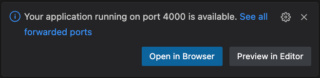

# stravaig-theme

## Working with this repo

This repo is designed to work inside a dev container.

### You will need

Install the following to get started

* Docker
* Visual Studio Code

# Steps to set up your dev environment

* Clone the repo to your local drive.
* Open the repo folder in Visual Studio Code
* When the popup appears, click "Reopen in Container". This has the advantage of being able to edit files outside the container in your local file system and being able to reflect those changes instantly inside the container. For development like this the performance I/O boost by cloning inside the container is negligible.

* The first time it will take about a minute or so to pull down all the bits and pieces it needs to run.
* To check it has everything, open a terminal inside Visual Studio code and at the prompt type `jekyll serve`

*  When the build cycle is complete, you'll see a popup that says "Your application running on port 4000 is available". And a button to "Open in Browser". Click that button.

 

